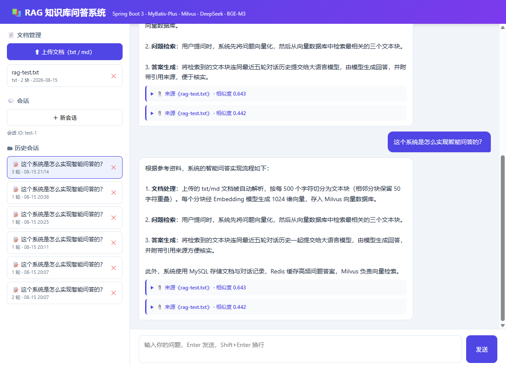

# 📚 RAG 知识库问答系统

基于 **Spring Boot 3** + **Milvus** + **DeepSeek** 的企业知识库智能问答系统：上传文档自动向量化入库，用户提问时由大模型基于知识库内容回答，并附带引用来源。



## ✨ 功能特性

| 模块 | 说明 |
|---|---|
| 📄 文档入库 | 上传 TXT / Markdown，自动完成 解析 → 分块（500 字 + 50 重叠）→ Embedding（BGE-M3 1024 维）→ 写入 Milvus |
| 💬 RAG 问答 | 问题向量化 → Milvus 检索 Top3 → 拼接 Prompt → DeepSeek 生成回答 → 返回答案 + 引用来源 |
| 🧠 多轮对话 | 自动维护会话，最近 5 轮历史注入 Prompt，支持上下文追问；对话记录持久化到 MySQL |
| ⚡ 流式输出 | SSE 逐字推送，打字机效果 |
| 🗄 高频缓存 | Redis 缓存相同问题答案（TTL 1 小时），命中即返，避免重复调用大模型 |
| 🖥 Web 界面 | 内置前端（无需独立部署）：文档管理 + 聊天 + 历史会话恢复/删除 |
| 🔌 RESTful API | 完整接口，可用 Postman 演示 |

## 🛠 技术栈

| 分类 | 技术 |
|---|---|
| 后端框架 | Spring Boot 3.5 · Java 17 |
| 持久层 | MyBatis-Plus 3.5 · MySQL 8 |
| 向量数据库 | Milvus 2.4（Standalone，COSINE 度量） |
| 缓存 | Redis 7 |
| 大模型 | DeepSeek `deepseek-v4-flash` |
| Embedding | 硅基流动 `BAAI/bge-m3`（1024 维） |
| 中间件部署 | Docker Compose |

## 🚀 快速开始

### 1. 环境要求

- JDK 17+，Maven 3.9+（IDEA 自带亦可）
- Docker Desktop
- DeepSeek API Key、硅基流动 API Key

### 2. 启动中间件

```bash
# MySQL 8（映射 3307，避免与本机 3306 冲突）
docker run -d --name rag-mysql -p 3307:3306 \
  -e MYSQL_ROOT_PASSWORD=root123456 -e MYSQL_DATABASE=rag_kb \
  -v mysql-data:/var/lib/mysql --restart unless-stopped mysql:8.0 \
  --character-set-server=utf8mb4 --collation-server=utf8mb4_unicode_ci

# Redis 7（映射 6380）
docker run -d --name redis -p 6380:6379 --restart unless-stopped redis:7-alpine

# Milvus 2.4（etcd + MinIO + standalone 三件套）
docker compose -f docker/docker-compose.yml up -d
```

### 3. 初始化数据库

```bash
docker exec -i rag-mysql mysql -uroot -proot123456 rag_kb < src/main/resources/db/schema.sql
```

### 4. 配置 API Key

编辑 `src/main/resources/application-local.yml`（已被 `.gitignore` 忽略，不会上传仓库）：

```yaml
spring:
  datasource:
    password: root123456
llm:
  deepseek:
    api-key: 你的 DeepSeek Key
  embedding:
    api-key: 你的硅基流动 Key
```

### 5. 运行

IDEA 直接运行 `RagApplication`，或：

```bash
mvn spring-boot:run
```

浏览器打开 **http://localhost:8080**

## 📁 项目结构

```
src/main/java/com/example/rag/
├── config/          # 配置类（Redis / Milvus / Embedding / DeepSeek / 线程池）
├── controller/      # REST 接口
├── service/         # 业务层
│   ├── document/    #   文档解析 / 分块 / 上传流水线
│   ├── embedding/   #   Embedding 接口 + SiliconFlow 实现
│   ├── vector/      #   Milvus 向量库封装
│   ├── llm/         #   DeepSeek 客户端 + RAG 问答核心
│   └── chat/        #   对话记录 / 会话缓存
├── mapper/          # MyBatis-Plus Mapper
├── entity/          # 实体
├── dto/             # 请求响应对象
└── common/          # 统一返回 Result / 全局异常

src/main/resources/
├── static/          # 内置 Web 前端（纯 HTML/CSS/JS）
└── db/schema.sql    # 建表 SQL
```

## 📡 API 接口

### 文档

| 方法 | 路径 | 说明 |
|---|---|---|
| POST | `/api/documents/upload` | 上传 txt/md（multipart，字段名 `file`） |
| GET | `/api/documents` | 文档列表 |
| DELETE | `/api/documents/{id}` | 删除文档（同步清理 Milvus 向量） |

### 问答

| 方法 | 路径 | 说明 |
|---|---|---|
| POST | `/api/chat` | 问答 `{"sessionId":?, "question":?}` → `{answer, citations}` |
| POST | `/api/chat/stream` | 流式问答（SSE，打字机效果） |
| GET | `/api/chat/sessions` | 历史会话列表 |
| GET | `/api/chat/history/{sessionId}` | 会话历史 |
| DELETE | `/api/chat/sessions/{sessionId}` | 删除会话 |

### 其他

| 方法 | 路径 | 说明 |
|---|---|---|
| GET | `/api/ping` | 健康检查 |

## 📝 注意事项

- 更换 Embedding 模型（维度变化）时，需删除 Milvus 集合重建（应用启动时若集合不存在会自动创建）
- 端口约定：MySQL `3307`、Redis `6380`、Milvus `19530`（`6379` 留给本机其他 Redis 服务）
- 单轮问题（未传 `sessionId`）会写入 Redis 缓存；多轮问题依赖上下文，不缓存
- 删除文档会同步删除其全部向量，不留孤儿数据

## 📄 License

[MIT](LICENSE)
